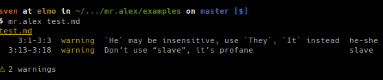

mr.alex
=======

`alex <http://alexjs.com/>`_ running in a docker container based on Alpine

Whether your own or someone else’s writing, alex helps you find gender favoring, polarizing, race related, religion inconsiderate, or other unequal phrasing.

Features
--------

- checks your docs for gender favoring, polarizing, race related, religion inconsiderate, or other unequal phrasing.

Examples
--------

Usage
-----

We have some examples in /examples so we will use these

.. code-block:: bash

	cd examples
	docker run -it --rm -v $(pwd)/:/build mr.alex test.md

What it does
------------

It starts a container, mounts your [current dir]/docs directory into the container to /build and runs alex against it.

Documentation
-------------

Full documentation for end users can be found in the "docs" folder.

Contribute
----------

- `Issue Tracker <github.com/tiramisusolutions/dockerfiles/mr.alex/issues>`_
- `Source Code <github.com/tiramisusolutions/dockerfiles/mr.alex>`_

Support
-------

If you are having issues, please let us know.

.. todo:: pic, more/better docs, add configs like allowed words to docs

for f in *.rst ; do alex $f -t ; done

Remember:

since alex are only does rst we need to do:

- save html of file we build with sphinx, convert it to md with pandoc and run alex against it
- create custom .alexrc with 'allowed words' 

