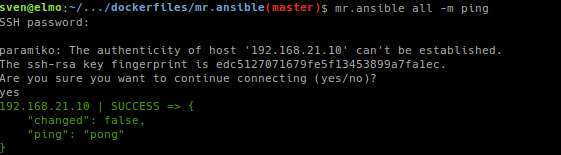

# mr. ansible
## Alpine Ansible Container

Running [Ansible](https://www.ansible.com/) in a [Alpine](http://www.alpinelinux.org/) based [Docker](https://www.docker.com/) Container.

## Features
- runs [Ansible](https://www.ansible.com/) in a [Docker](https://www.docker.com/) Container

## Documentation

Full documentation for end users can be found in the "docs" folder.

## Dependencies

[Docker](https://docker.com "Homepage of docker")

## Installation

Pull the image:

    docker pull quay.io/tiramisu/mr.ansible

## Contribute

- [Issue Tracker](github.com/tiramisusolutions/mr.ansible/issues)
- [Source Code](github.com/tiramisusolutions/mr.ansible)

## Support

If you are having issues, please let us know.

